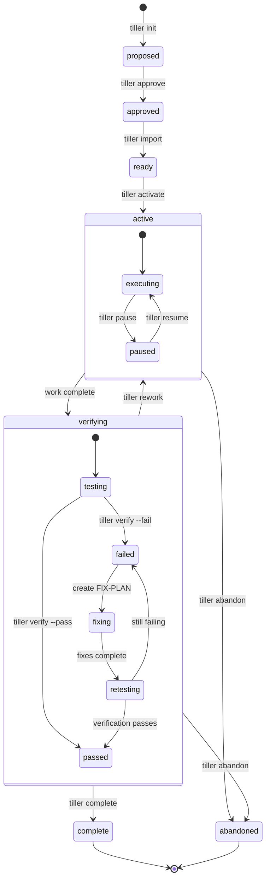

# Tiller

**Built on [GSD (Get Shit Done)](https://github.com/glittercowboy/get-shit-done) workflow patterns** by glittercowboy. Tiller is a successor system designed for agent-first interaction with explicit state machines, CLI discoverability, and deterministic transitions. See [GSD Analysis](docs/GSD-ANALYSIS.md) and [Feature Parity Mapping](docs/GSD-TILLER-MAPPING.md) for the evolution story.

---

Multi-session workflow automation for Claude Code. This repository contains two complementary tools:

- **ahoy** - Demand-side spec creation and proposal management (`specs/`)
- **tiller** - Supply-side execution tracking and state management (`plans/`)

## Installation

**Prerequisites:**
- [Bun](https://bun.sh) runtime (not npm/node)
- Claude Code CLI

**Install from source:**

```bash
# Clone the repository
git clone https://github.com/gulp/tiller
cd tiller

# Install dependencies and build
bun install
bun run build

# Link globally
bun link

# Verify installation
tiller --version
ahoy --version
```

## Claude Code Integration

Tiller is a CLI tool that works with Claude Code. The plugin provides hooks to help Claude discover and use tiller commands quickly.

### Option 1: Enable as Marketplace Plugin (Basic Hooks)

In Claude Code:
1. Run `/plugin` command
2. Navigate to **Marketplaces** tab
3. Click **+ Add Marketplace**
4. Enter marketplace source: `https://github.com/gulp/tiller` (or `gulp/tiller`)
5. Navigate to **Discover** tab and enable "tiller" and/or "ahoy" plugins

**Note:** Marketplace plugins support limited hooks (SessionStart, PreCompact only).

### Option 2: Full Hook Support (Recommended)

For complete hook coverage (PreToolUse, PostToolUse, Stop, etc.):

```bash
# Run setup to install hooks
tiller setup claude

# This configures:
# - All tiller hooks (verification, sync, status)
# - Custom startup behaviors
# - Pre-commit validation
```

## What is This?

This monorepo implements a **demand vs supply** workflow for AI-assisted development:

### ahoy (Demand Side)
**Purpose:** Explore ideas, draft proposals, answer "Is this worth building?"

- Create unnumbered drafts (`specs/feature-name/`)
- Write `scope.md` to define problem and desired state
- Assign sequential IDs when ready (`ahoy number` → `specs/0001-feature-name/`)
- Create `PROPOSAL.md` when mature

### tiller (Supply Side)
**Purpose:** Execute approved work, track state, verify completion

- **Multi-initiative support** - Organize work into initiatives (products, components, workstreams) with session-scoped focus (`tiller focus`)
- **Plan-based workflow** - Organize work into phases and plans with clear objectives
- **State machine tracking** - Progress through: proposed → approved → ready → active → verifying → complete
- **Cross-session persistence** - Survive context compaction and session resets
- **Verification gates** - UAT workflows with pass/fail status and auto-completion
- **Git-native sync** - JSONL-based state sharing across machines (beads pattern)

**Initiatives are flexible organizational units.** They can be:
- Separate products (`tiller-cli`, `auth-service`)
- Components in a monorepo (`web/ui`, `web/auth`, `web/api`)
- Major workstreams or subsystems (`app/mobile`, `app/desktop`)

The term "initiative" avoids overloading "feature" (which gets confusing in monorepos).

**The Boundary:** `tiller accept` is the only crossing point from demand → supply.

```bash
# Demand side (ahoy) - Exploration
ahoy draft dark-mode              # Create specs/dark-mode/
ahoy discuss dark-mode            # Interactive requirements gathering
ahoy research dark-mode           # Explore codebase for implementation approach
# ... refine scope.md ...
ahoy number dark-mode             # Ready → assign ID: specs/0003-dark-mode/

# Cross the boundary
tiller accept 0003-dark-mode --as-initiative myapp --phases 3

# Supply side (tiller) - Execution
tiller activate 01-01             # Execute first plan (phase 01, plan 01)
tiller verify 01-01 --pass        # Verify completion
tiller complete 01-01             # Generate SUMMARY.md
```

See [ADR-0005: Demand vs Supply](docs/adrs/ADR-0005-demand-vs-supply.md) for the complete mental model.

## Getting Started

**Sample conversation with Claude:**

```
You: "I want to add dark mode to my app"

Claude: "Let me help you implement dark mode. First, I'll use
EnterPlanMode to create an implementation plan..."

[Claude creates PLAN.md with phases]

You: "tiller init plans/dark-mode-PLAN.md"

Claude: "Created run-abc123 in 'proposed' state. Use
'tiller approve abc123' to begin."

You: "tiller approve abc123"
You: "tiller activate abc123"

Claude: "Starting execution... [implements dark mode]"
Claude: "Entering verification phase. Run 'tiller verify abc123'
when you've tested the changes."

You: "tiller verify abc123 --pass"

Claude: "✓ Verification passed. Run 'tiller complete abc123'
to finish."
```

**How it works:**

1. **Planning** - Claude creates PLAN.md files with objectives and tasks
2. **Initialization** - `tiller init` creates a run (state tracking)
3. **Execution** - `tiller activate` transitions to active/executing
4. **Verification** - `tiller verify` captures UAT results (pass/fail)
5. **Completion** - `tiller complete` finalizes and generates SUMMARY.md
6. **Persistence** - State survives context resets via `.tiller/runs.jsonl`

For detailed workflow patterns and state machine behavior, see [TILLER-DESIGN.md](docs/TILLER-DESIGN.md).

## Documentation

Detailed design docs and architecture:

- [Design Overview](docs/TILLER-DESIGN.md) - Architecture and patterns
- [CLI Reference](docs/TILLER-CONTRACT.md) - Complete command documentation
- [Installation Guide](docs/TILLER-INSTALL.md) - Setup and configuration
- [GSD Analysis](docs/GSD-ANALYSIS.md) - What Tiller took from GSD and why
- [GSD Feature Mapping](docs/GSD-TILLER-MAPPING.md) - Command-by-command comparison
- [ADRs](docs/adrs/) - Architectural decision records

## Core Commands

> **Note:** These commands are designed for Claude to run autonomously. You typically won't run them directly - Claude discovers them via `--help` and executes them based on workflow state.
>
> If you do run commands in your terminal, add `--pretty` for human-readable output:
> ```bash
> tiller status --pretty
> tiller show 01-01 --pretty
> ```
>
> By default, tiller outputs TOON format (structured data for agents).

### ahoy (Demand Side - Specs)

```bash
# Create and explore
ahoy draft <name>          # Create unnumbered draft (specs/name/)
ahoy show <draft>          # Display draft contents
ahoy discuss <draft>       # Gather requirements via interactive questions
ahoy research <draft>      # Research how to implement (codebase exploration)
ahoy scope <draft>         # Read/write scope.md

# Commit when ready
ahoy number <draft>        # Assign sequential ID (specs/0001-name/)
ahoy lock <draft>          # Mark as committed (adds .lock suffix)
ahoy status [draft]        # Show draft lifecycle state
```

### tiller (Supply Side - Execution)

```bash
# Accept spec into execution (demand → supply boundary)
tiller accept <spec-ref> --as-initiative <name> --phases <n>

# Multi-initiative management
tiller focus <initiative>  # Set working initiative for session
tiller initiative list     # Show all initiatives
tiller status              # Show current state and next actions (respects focus)

# Run lifecycle (HSM state machine)
tiller init <plan>         # Create run from PLAN.md (→ proposed)
tiller approve <ref>       # Approve for execution (proposed → approved)
tiller activate <ref>      # Start execution (ready → active/executing)
tiller pause <ref>         # Pause active work (→ active/paused)
tiller resume <ref>        # Resume paused work (→ active/executing)

# Verification gates
tiller verify <ref> --pass # Mark verification passed (→ verifying/passed)
tiller verify <ref> --fail # Mark verification failed (→ verifying/failed)
tiller complete <ref>      # Finalize run and generate SUMMARY.md (→ complete)

# Cross-machine sync (beads pattern)
tiller sync                # Bidirectional: import JSONL → local, export local → JSONL
tiller sync --export       # Export only: local runs → runs.jsonl
```

## Architecture

Tiller uses:
- **HSM state machine** - Hierarchical states (active/executing, verifying/testing, etc.) - see [State Machine Design](docs/TILLER-DESIGN.md#state-machine)
- **Two-layer sync** - JSON cache + JSONL source of truth (beads pattern)
- **TOON output format** - Structured data + agent guidance - see [TOON Specification](docs/TILLER-CONTRACT.md#toon-output)
- **Agent-first contracts** - CLI discoverability, semantic clarity, `--help` as documentation

For complete architecture documentation, see [TILLER-DESIGN.md](docs/TILLER-DESIGN.md).

### State Machine Workflow



See [docs/TILLER-DESIGN.md](docs/TILLER-DESIGN.md) for details.

## Credits

Built on workflow patterns from [GSD (Get Shit Done)](https://github.com/glittercowboy/get-shit-done) by glittercowboy.

**What Tiller took from GSD:**
- Spec-driven development philosophy (Phase 1 human-led, Phase 2 AI-driven)
- PLAN.md as source of truth
- Multi-phase project structure
- Verification checkpoints and UAT workflow

**What Tiller changed:**
- Explicit state machine with hierarchical states (not inferred)
- TOON output format for deterministic agent guidance
- Two-layer sync pattern (JSON + JSONL)
- CLI-first design (not slash commands)

See [GSD Analysis](docs/GSD-ANALYSIS.md) for detailed breakdown and [Feature Parity Mapping](docs/GSD-TILLER-MAPPING.md) for command-by-command comparison.

**Additional inspirations:**
- [beads](https://github.com/steveyegge/beads) - CLI fluency and `bd ready` pattern
- [agent-browser](https://agent-browser.dev/) - Agent-first CLI design

## Why CLI Instead of Slash Commands?

**Models are exceptionally well-trained on CLI commands.** They're fluent with discoverable patterns: `--help` text, man pages, file-based state, markdown docs they can grep.

### Problems with Slash Commands (from GSD experience)

1. **Execution order is hard to remember** - Which command comes first? `/gsd:plan-phase` or `/gsd:discuss-phase`?
2. **No discoverability** - Models must memorize system prompts. No `--help` to reference.
3. **Context-dependent** - Commands work differently depending on what phase you're in
4. **Inference-heavy** - Models guess what state you're in and what comes next

### Advantages of CLI Design

1. **Self-documenting** - `tiller --help`, `tiller status --help`, discoverable without prompts
2. **Explicit state** - `tiller status` shows exactly where you are and what's next
3. **Deterministic** - Commands do the same thing regardless of context
4. **File-based state** - Everything in `.tiller/` and `plans/` that agents can read/grep
5. **TOON output** - Every command returns structured data + `agent_hint` for next step

**The pattern:** When you give agents CLI tools with clear contracts, they become autonomous. No ceremony, just good interfaces.

## Background: Why Tiller?

> **Note:** I'm a UX designer who built this through "vibecoding" - explaining ideas to Claude and iterating on generated code. This entire codebase was created through AI-assisted development, which shaped its design philosophy.

For the last 10 months, I've been exploring how to build tools that agents can use fluently. I tried every framework I could find:

- **[GSD (Get Shit Done)](https://github.com/glittercowboy/get-shit-done)** - Used it extensively, loved the spec-driven philosophy, but needed more explicit state tracking and deterministic transitions. Tiller directly builds on GSD's workflow patterns.
- **[SpecKit](https://github.com/github/spec-kit)** - Taught me about machine-readable contracts, but hard to track what's built vs. what's planned.
- **[beads](https://github.com/steveyegge/beads)** - Brilliant for issue tracking (`bd ready` pattern), but I needed lifecycle gates and approval checkpoints.

See [docs/GSD-ANALYSIS.md](docs/GSD-ANALYSIS.md) for detailed analysis of what I took from GSD and why I built Tiller.

### The Discovery: CLI-First Design

The breakthrough came from watching agents interact with tools like [beads](https://github.com/steveyegge/beads) and [agent-browser](https://agent-browser.dev/). When you give models a well-designed CLI with `--help` and clear contracts, they become fluent without system prompts. No ceremony, just good interfaces.

This led to three core principles:

**1. TOON Pattern (Token-Oriented Object Notation)**

Instead of making agents guess what to do next, tell them explicitly:

```toon
accept:
  spec: specs/0001-feature
  phases_created: 3
  plans[3]{ref,run_id,state}:
    06.1,run-abc,ready
    06.2,run-def,ready
    06.3,run-ghi,ready

agent_hint: "Plans are ready. Next: tiller activate 06.1"
```

Every command returns structured data + meta-instruction. Agents know exactly what happened and what to do next.

**2. State Machine as Interface**

Tiller uses hierarchical states (`active/executing`, `verifying/passed`) that are semantic for both agents and humans. Every command returns the current state and available transitions. Agents query `tiller status`, understand where they are, proceed autonomously.

The `bd ready` pattern from beads: agents ask "what's unblocked?" and get a deterministic answer.

**3. File-Based State Visibility**

Everything lives in files that agents and humans both see:
- `plans/` directory structure is explorable
- `.tiller/runs.jsonl` is git-tracked state (beads pattern)
- SUMMARY.md files show what was accomplished
- State changes are visible in your file tree, not buried in logs

### Agent UX vs. Traditional UX

Traditional UX reduces friction for humans through clicks, forms, navigation.

**Agent UX reduces friction for models** - and models are fluent with:
- CLI commands with clear contracts
- File-based state they can read/write
- JSON output they can parse
- `--help` text and man pages

This isn't about "better tools for humans using AI." It's about **designing interfaces that models natively understand.**

When you give agents discoverable patterns (CLIs, filesystem structure, markdown docs they can grep), they become autonomous. Tiller is my attempt at this - an experiment in what happens when you design *for* agent ergonomics, not against them.

## Contributing

This is MIT licensed - do whatever you want with it. Fork it, improve it, break it, make it yours.

I built this through "vibecoding" with Claude and I'm not experienced at maintaining open source projects. If you see something broken or have ideas, feel free to open issues or PRs. No promises on response time, but I'm interested in seeing what people build with it.

The codebase follows some patterns documented in [CLAUDE.md](CLAUDE.md) if you want to understand the philosophy, but there are no strict rules.

## License

MIT - see [LICENSE](LICENSE) file
