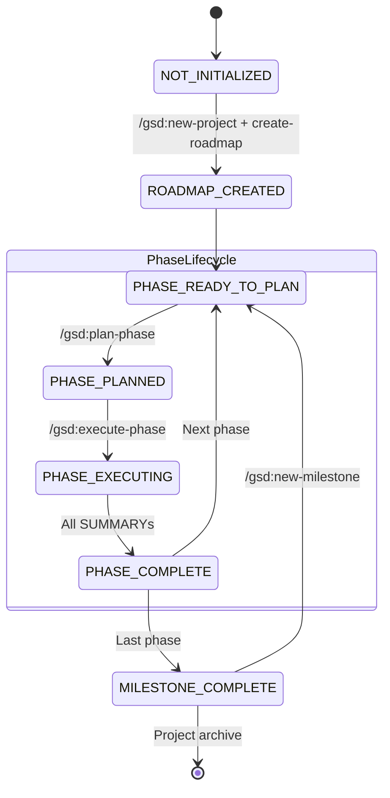
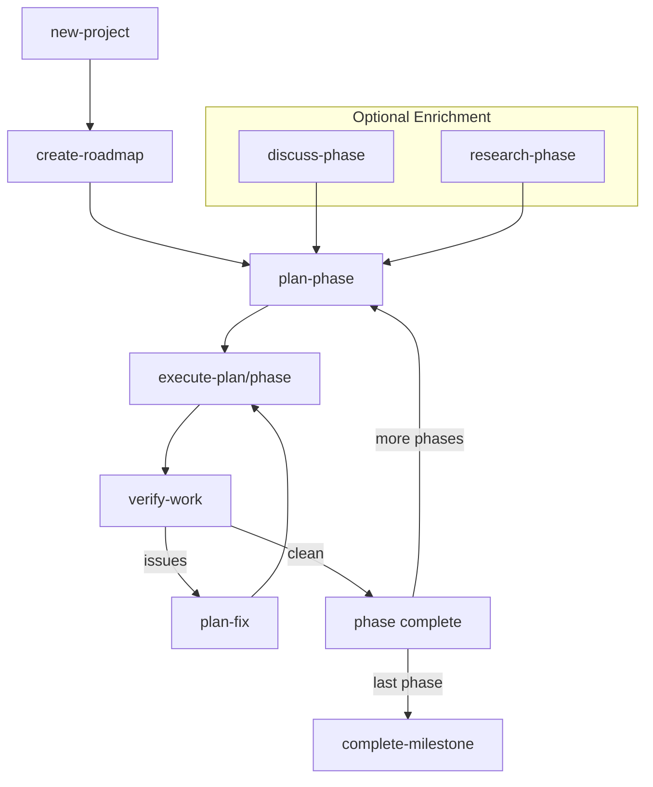

# GSD (Get Shit Done) Framework Analysis

> [!NOTE]
> **Historical reference.** This document analyzes GSD (the predecessor system) to
> inform Tiller's design. GSD is no longer actively used.

Complete analysis of the GSD framework for designing Tiller, its successor.

## 1. State Machine

### Project Lifecycle States

```
NOT_INITIALIZED
  → ROADMAP_CREATED
      → PHASE_READY_TO_PLAN
          → PHASE_PLANNED
              → PHASE_EXECUTING
                  → PHASE_COMPLETE
                      → MILESTONE_COMPLETE
                          → PROJECT_ARCHIVE
```

### Phase States

| State | Entry | Exit | Next States |
|-------|-------|------|-------------|
| `PHASE_REQUIRES_DISCUSSION` | /gsd:discuss-phase | CONTEXT.md created | READY_TO_PLAN, REQUIRES_RESEARCH |
| `PHASE_REQUIRES_RESEARCH` | /gsd:research-phase | RESEARCH.md created | READY_TO_PLAN |
| `PHASE_READY_TO_PLAN` | Phase dir exists, no PLAN.md | /gsd:plan-phase | PHASE_PLANNED |
| `PHASE_PLANNED` | PLAN.md(s) exist | /gsd:execute-phase | PHASE_EXECUTING |
| `PHASE_EXECUTING` | Subagents spawned | All SUMMARYs exist | PHASE_COMPLETE |
| `PHASE_COMPLETE` | All plans have SUMMARY | Transition workflow | Next phase or MILESTONE_COMPLETE |

### Execution States (Wave-Parallel Model)

```
PHASE_EXECUTING
├── WAVE_1_EXECUTING (parallel)
│   ├── PLAN_EXECUTING (agent 1)
│   ├── PLAN_EXECUTING (agent 2)
│   └── CHECKPOINT_PAUSED (if hit)
├── WAVE_1_COMPLETE
├── WAVE_2_EXECUTING (parallel)
└── PHASE_COMPLETE
```

### Checkpoint States

| Type | Purpose | Frequency |
|------|---------|-----------|
| `human-verify` | User confirms work | 90% |
| `decision` | User picks option | 9% |
| `human-action` | Unavoidable manual step | 1% |

---

## 2. Context Loading Architecture

### Tag System

| Tag | Purpose | Timing | Typical Size |
|-----|---------|--------|--------------|
| `<required_reading>` | Mandatory state load | FIRST | 300-500 tokens |
| `<execution_context>` | How to execute | Before tasks | 8,000-12,000 tokens |
| `<context>` | What to execute | Before tasks | 2,000-5,000 tokens |

### Progressive Disclosure Rules

1. **Always load**: PROJECT.md, ROADMAP.md, STATE.md
2. **Load if needed**: Prior SUMMARY.md (only if depends_on)
3. **Never chain**: Don't include Plan 02 summary just because Plan 01 exists

### Token Usage Per Agent

```
Orchestrator:      ~1,500 tokens (1% budget)
Autonomous agent:  ~15,000-20,000 tokens (fresh per plan)
Continuation:      ~8,000-10,000 tokens (after checkpoint)
```

### Caching Opportunities

Static files loaded every execution:
- execute-plan.md (~4,500 tokens)
- summary.md template (~700 tokens)
- checkpoints.md (~3,000 tokens)

**Potential savings with LLM caching**: ~88% reduction

---

## 3. Command Dependency Graph

### Critical Path

```
new-project → create-roadmap → plan-phase → execute-plan → verify-work
```

### Command Dependencies

| Command | Requires | Produces |
|---------|----------|----------|
| `new-project` | - | PROJECT.md, config.json |
| `create-roadmap` | PROJECT.md | ROADMAP.md, STATE.md, phase dirs |
| `discuss-phase` | ROADMAP.md | {phase}-CONTEXT.md |
| `research-phase` | ROADMAP.md | {phase}-RESEARCH.md |
| `plan-phase` | ROADMAP.md | {phase}-{N}-PLAN.md |
| `execute-plan` | PLAN.md | {phase}-{N}-SUMMARY.md |
| `execute-phase` | All PLANs | All SUMMARYs |
| `verify-work` | SUMMARY.md | ISSUES.md (if problems) |
| `plan-fix` | ISSUES.md | FIX.md |
| `complete-milestone` | All SUMMARYs | Archive, git tag |

### Parallel-Safe Commands

Within execute-phase:
- Multiple execute-plan calls (same wave)

Independent operations:
- discuss-phase (multiple phases)
- research-phase (multiple phases)
- plan-phase (multiple phases)

### Blocking Points

- PROJECT.md → all operations
- ROADMAP.md → phase operations
- PLAN.md → execution
- SUMMARY.md → phase completion

---

## 4. Progressive Disclosure Patterns

### Execution Level Context

| Level | Loads | Skips |
|-------|-------|-------|
| Orchestrator | Plan frontmatter, STATE | Full PLAN, workflows |
| Subagent | Full PLAN, workflows, context | Previous segment state |
| Main (checkpoint) | Checkpoint return, STATE | Original workflows |

### Context Boundaries

Each tag type creates natural boundaries:
1. Gets loaded at specific timing
2. Has defined size constraints
3. Can be cached independently
4. Enables clean checkpoint/continuation flow

---

## 5. Key Insights for Tiller

### What GSD Does Well

1. **Atomic commits** per task enable git bisect
2. **Wave-parallel execution** maximizes throughput
3. **Checkpoint system** keeps human in loop
4. **STATE.md** provides session persistence
5. **SUMMARY.md** captures execution context

### What GSD Struggles With

1. **Slash command dependency** - requires user to know order
2. **Implicit state** - hard for agents to query "where am I?"
3. **Token overhead** - workflows reload every subagent
4. **No dashboard** - visibility requires reading multiple files

### Tiller Design Implications

1. **Explicit state machine** - deterministic transitions
2. **Track abstraction** - bounded line of intent
3. **Read-only beads integration** - operational truth
4. **CLI-first** - works outside Claude Code
5. **Dashboard + event log** - multi-actor visibility

---

## 6. State Transition Rules

### Deviation Rules (During Execution)

1. **Auto-fix bugs** → Fix inline, document in SUMMARY
2. **Auto-add critical** → Security/correctness gaps
3. **Auto-fix blockers** → Can't proceed without
4. **Ask about architectural** → STOP, present to user
5. **Log enhancements** → Add to ISSUES.md, continue

### Resumption Rules

1. Read STATE.md for last position
2. Find first incomplete plan (PLAN exists, SUMMARY doesn't)
3. Resume from that plan forward
4. Can resume subagent via agent_id OR spawn fresh continuation

---

## 7. File Artifacts

| File | Purpose | Updated When |
|------|---------|--------------|
| PROJECT.md | Vision, requirements, decisions | After phase transition |
| ROADMAP.md | Phase structure, dependencies | After phase/milestone |
| STATE.md | Current position, metrics | After each plan |
| PLAN.md | Executable task plan | During planning |
| SUMMARY.md | Execution results | After plan complete |
| CONTEXT.md | Phase context from discussion | During discuss-phase |
| RESEARCH.md | Ecosystem findings | During research-phase |
| ISSUES.md | Deferred enhancements | During execution |

---

## 8. Mermaid Diagrams

### State Machine



### Command Flow



---

## Summary

GSD is a **hierarchical, wave-parallel execution framework** with:

- **5 project states**: Initialize → Roadmap → Phases → Milestone → Archive
- **6 phase states**: Discuss → Research → Plan → Execute → Verify → Complete
- **3 checkpoint types**: human-verify, decision, human-action
- **27 commands** with strict dependency ordering
- **Progressive context disclosure** via tagged sections

**Key weakness**: Requires human to invoke commands in correct order.
**Key strength**: Atomic commits and wave-parallel execution.

Tiller will preserve the strengths while adding explicit state tracking and agent-queryable interfaces.
